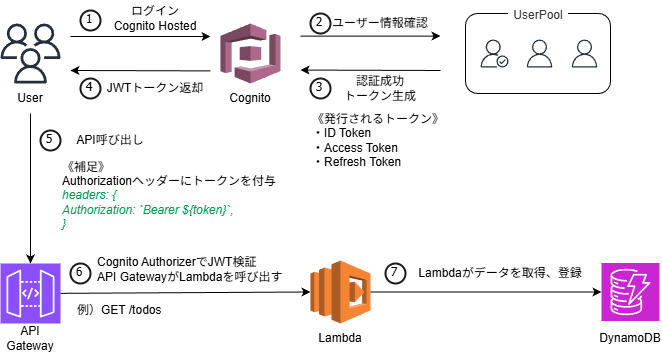

# 📘 Serverless Todo API (AWS CDK + Cognito)

AWS CDK を使用して構築した  
**認証付きサーバーレス Todo API**です。

このプロジェクトでは以下のAWSアーキテクチャを実装しています。

- Serverless Architecture
- Cognito Authentication
- JWT Authorization
- API Gateway Authorizer
- DynamoDB NoSQL
- Infrastructure as Code (AWS CDK)

---

# 🧭 Architecture Overview

User  
↓  
Cognito Hosted UI  
↓  
JWT Token  
↓  
API Gateway (Cognito Authorizer)  
↓  
Lambda  
↓  
DynamoDB

---

# 🏗 Architecture Diagram



図ファイル

```
docs/architecture.drawio
```

---

# 🔐 Authentication Flow

本アプリは **Amazon Cognito を使用したJWT認証**を実装しています。

### 認証フロー

1. User が Cognito Hosted UI にログイン
2. Cognito が UserPool のユーザー情報を確認
3. 認証成功
4. JWTトークン発行

発行されるトークン

- ID Token
- Access Token
- Refresh Token

5. Client が API を呼び出す

```
Authorization: Bearer <JWT_TOKEN>
```

6. API Gateway が JWT を検証
7. Lambda 実行
8. DynamoDB 操作

---

# 🧩 AWS Services

| Service        | Purpose                |
| -------------- | ---------------------- |
| Amazon Cognito | User Authentication    |
| API Gateway    | REST API               |
| AWS Lambda     | Business Logic         |
| DynamoDB       | Data Storage           |
| CloudWatch     | Logging                |
| AWS CDK        | Infrastructure as Code |
| CloudFormation | Deployment Engine      |

---

# 📂 Repository Structure

```
aws-serverless-cdk-todo-api
│
├─ bin
│   └ app.ts
│
├─ lib
│   └ todo-api-stack.ts
│
├─ lambdas
│   ├ createTodo
│   ├ listTodos
│   └ deleteTodo
│
├─ web
│   └ Next.js frontend
│
├─ docs
│   ├ architecture.drawio
│   └ architecture.png
│
├─ package.json
├─ tsconfig.json
├─ cdk.json
└ README.md
```

---

# ☁ Infrastructure as Code

AWS CDK を使用してインフラをコード管理しています。

### CDK Deploy Flow

```
CDK (TypeScript)
      ↓
cdk synth
      ↓
CloudFormation Template
      ↓
cdk deploy
      ↓
AWS Resources
```

---

# 👤 IAM Design

| Role                 | Purpose        | Policy              |
| -------------------- | -------------- | ------------------- |
| Developer            | Development    | PowerUserAccess     |
| Infrastructure Admin | Infrastructure | AdministratorAccess |

### 設計意図

- CDK bootstrap は IAM 操作が必要
- PowerUserAccess では IAM 操作不可
- 開発者とインフラ管理者の分離

---

# 🖥 AWS CLI Setup

CLI確認

```
aws --version
```

認証設定

```
aws configure --profile dev
aws configure --profile cdk-admin
```

認証確認

```
aws sts get-caller-identity --profile dev
```

---

# 🚀 AWS CDK Commands

### Bootstrap（初回のみ）

```
cdk bootstrap aws://<ACCOUNT_ID>/ap-northeast-1 --profile cdk-admin
```

作成されるリソース

- CDKToolkit stack
- S3 Staging Bucket
- ECR repository
- IAM roles

---

### Synth

```
cdk synth --profile cdk-admin
```

CloudFormation テンプレート生成

---

### Deploy

```
cdk deploy --profile cdk-admin
```

作成されるAWSリソース

- Cognito UserPool
- API Gateway
- Lambda
- DynamoDB

---

### Destroy

```
cdk destroy --profile cdk-admin
```

---

# 🌐 API Usage

## Create Todo

```
POST /todos
```

Header

```
Authorization: Bearer <JWT_TOKEN>
Content-Type: application/json
```

Request

```json
{
  "title": "first todo",
  "dueDate": "2026-02-20"
}
```

---

## List Todos

```
GET /todos
```

Header

```
Authorization: Bearer <JWT_TOKEN>
```

---

# 🧠 Learning Outcomes

このプロジェクトで学習した技術

- AWS CDK
- Serverless Architecture
- Cognito Authentication
- JWT Authorization
- API Gateway Authorizer
- DynamoDB Design
- IAM Design
- Infrastructure as Code

---

# 💰 Cost Model

| Service         | Pricing           |
| --------------- | ----------------- |
| Lambda          | Execution time    |
| API Gateway     | Request count     |
| DynamoDB        | Request + Storage |
| Cognito         | MAU               |
| CloudWatch Logs | Storage           |

---

# 🔮 Future Improvements

- PUT / DELETE 実装
- DynamoDB Query最適化
- GSI設計
- CloudFront + S3 フロント公開
- CI/CD (GitHub Actions)

---

# 🌏 Region

```
ap-northeast-1 (Tokyo)
```

---

# 👨‍💻 Author

Satoshi Hashimoto
